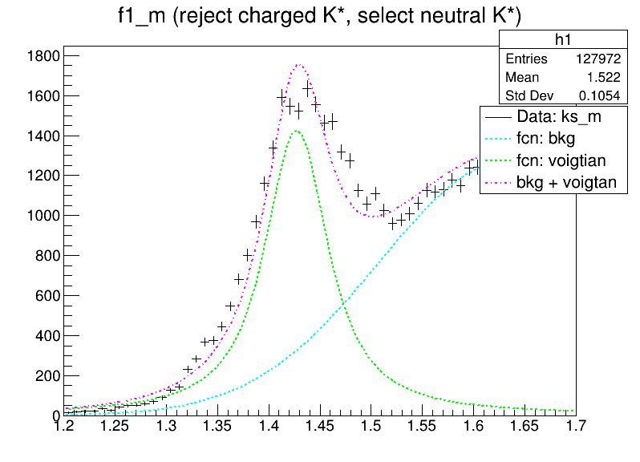
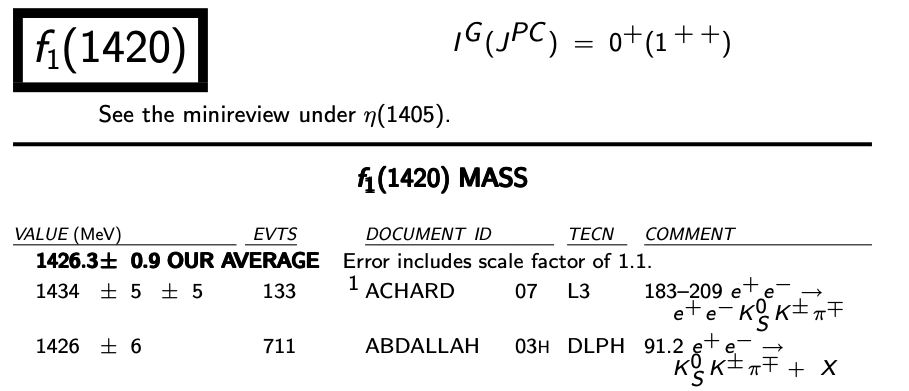

<!DOCTYPE html>
<html>
<head>
    <link rel="stylesheet" href="https://cdnjs.cloudflare.com/ajax/libs/reveal.js/3.8.0/css/reveal.min.css">
    
</head>
<body>

    

        

            <section data-markdown>
              
            </section>
            <section data-markdown>
              
            </section>
            <section data-markdown>
              
            </section>
        

    

    

</body>
</html>
